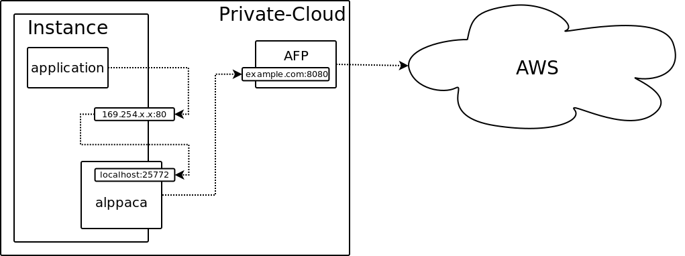

# alppaca
A(mazing) Local Prefetch Proxy for Amazon CredentiAls

# About

This prefeteches and proxies AWS temporary credentials from the [Instance
Metadata Server
(IMS)](https://github.com/ImmobilienScout24/aws-instance-metadata-server).

On any Amazon EC2 instance there is a special webserver that listens on a
link-local address and provides so-called [Instance
Metadata](http://docs.aws.amazon.com/AWSEC2/latest/UserGuide/ec2-instance-metadata.html).
When running applications on servers inside a private cloud that should
authenticate against AWS, this metadata server isn't available. Hence, we have
to build a bridge into AWS to provide temporary credentials for that
application, so that it believes it is being executed in the cloud even though
it is not. The first part of that bridge is the aforementioned IMS which
connects the private cloud to AWS. The second part is alppaca, pre-fetches the
credentials for an application via the IMS, caches them locally in memory and
exposes them via a HTTP service on the same server as the application. The main
reason for pre-fetching and caching is to ensure a response time below one
second, which is the AWS-SDK default. The webservice listens on
`localhost:5000` and an iptables rule is used to have it serve requests on
`169.254.169.254:80`. It is up to the IMS to decide which account and role to
use in order to obtain temporary credentials for the application/server.

# The how the internal redirect works

An iptables rule snippet redirect ensures that all requests to IP
`169.254.169.254:80` are redirected to `localhost:5000`.  This setup is not yet
generic since the /etc/iptables.d/nat.d directory is specific to IS24.  To
manually add the iptables rule, insert the following statement into your
iptables config:

```
-A OUTPUT -d 169.254.169.254/32 -p tcp -m addrtype --src-type LOCAL -j DNAT --to-destination 127.0.0.1:5000
```

And maybe you have to add:

```
-t nat
```

# alppaca as a service

Upstart is our weapon of choice to initialize alppaca during the boot phase as to ensure that credentials are cached before the application starts up.


# Playing around

Start ``tmux``.

Launch the mock IMS service in one tmux window:

```
$ PYTHONPATH=src/main/python python src/main/scripts/alppaca-server-mock
```

Launch ``alppaca`` in another:

```
$ PYTHONPATH=src/main/python python src/main/python/alppaca/main.py
```

Use ``curl`` to perform some requests in a third one:

```
$ curl localhost:5000/latest/meta-data/iam/security-credentials/
test_role
$ curl localhost:5000/latest/meta-data/iam/security-credentials/test_role
'{"Code": "Success", "AccessKeyId": "ASIAI", "SecretAccessKey": "oieDhF", "Token": "6jmePdXNehjPVt7CZ1WMkKrqB6zDc34d2vpLej", "Expiration": "2015-04-17T13:40:18Z", "Type": "AWS-HMAC"}'
```

And watch the logging info in the other two. Also, by default the credentials
are refreshed every minute, so you should see some logging info about that.

# Descriptive Haiku

_Authentication_<br />
_Local doesn't work for you_<br />
_Al's now got your back_

# Schematic



# License

Copyright 2015 Immobilienscout24 GmbH

Licensed under the Apache License, Version 2.0 (the "License");
you may not use this file except in compliance with the License.
You may obtain a copy of the License at

    http://www.apache.org/licenses/LICENSE-2.0

Unless required by applicable law or agreed to in writing, software
distributed under the License is distributed on an "AS IS" BASIS,
WITHOUT WARRANTIES OR CONDITIONS OF ANY KIND, either express or implied.
See the License for the specific language governing permissions and
limitations under the License.
